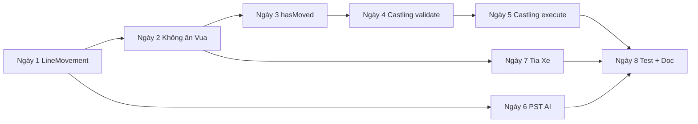

# Kế hoạch phát triển logic Quân Xe (Rook) — 8 ngày / 8 commit

> Tài liệu tham chiếu codebase: `DoAn/src/covua/chess/Rook.java`, `ChessGame.java`, `Board.java`, `King.java`  
> Ngày lập kế hoạch: 21/05/2026

---

## 1. Logic Quân Xe hiện có (đã làm)

### 1.1. Trong `Rook.isValidMove()`

| Hạng mục | Trạng thái | Mô tả |
|----------|------------|--------|
| Không đứng yên | ✅ | `isSameMove()` → `false` |
| Chỉ đi ngang/dọc | ✅ | Cùng `row` hoặc cùng `column`; khác cả hai → `false` |
| Không nhảy qua quân | ✅ | Duyệt ô giữa `start` và `end`, có quân → `false` |
| Đi ô trống | ✅ | `destinationPiece == null` → `true` |
| Ăn quân địch | ✅ | `destinationPiece.getColor() != this.color` → `true` |
| Không ăn quân cùng màu | ✅ | Còn lại → `false` |

### 1.2. Trong `ChessGame` (liên quan xe)

| Hạng mục | Trạng thái | Mô tả |
|----------|------------|--------|
| Gợi ý nước hợp lệ (UI) | ✅ | `case "Rook"` → `addLineMoves()` 4 hướng |
| Không cho ăn Vua trên UI | ✅ | `addLineMoves` bỏ qua nếu `target instanceof King` |
| Không tự chiếu sau nước đi | ✅ | `makeMove` clone + `isInCheck` |
| Gợi ý nước + mô phỏng | ✅ | `isLegalMoveAfterSimulation()` |

### 1.3. AI

| Hạng mục | Trạng thái |
|----------|------------|
| Giá trị quân cờ | ✅ Rook = 500 trong `Evaluator.java` |

---

## 2. Thiếu sót / lỗi cần xử lý (liên quan Xe)

### 2.1. Lỗi / không nhất quán

1. **Ăn Vua qua `isValidMove`**: Trong `Rook.java` đoạn chặn `King` đang **comment**. `Board.movePiece()` chỉ gọi `isValidMove` — nếu AI hoặc code khác không qua `getLegalMoves`, vẫn có thể ăn Vua (đúng với `note.txt`: *"Vẫn còn ăn vua được"*).
2. **Trùng logic**: `Rook` và `Queen` (phần đi thẳng) gần giống nhau; `ChessGame.addLineMoves` lặp lại ý tưởng lần nữa → khó bảo trì.
3. **Không có `hasMoved`**: Không lưu xe đã đi chưa → **không làm nhập thành (castling)** đúng luật.
4. **Nhập thành**: Chưa có trong `King`, `Rook`, `Board`, `ChessGame`.
5. **`makeMoveForAI`**: Không kiểm tra chiếu sau nước đi (ảnh hưởng AI khi xe di chuyển).

### 2.2. Tính năng có thể làm thêm (ưu tiên cho đồ án)

| # | Tính năng | Lợi ích | Độ khó |
|---|-----------|---------|--------|
| A | Tách `LineMovement` dùng chung (Xe, Hậu, một phần `addLineMoves`) | Code sạch, ít bug | Trung bình |
| B | Chặn ăn Vua thống nhất ở tầng `Piece` / `Rook` | Sửa lỗi nghiêm trọng | Thấp |
| C | `hasMoved` trên quân (ít nhất Xe + Vua) | Nền cho nhập thành | Trung bình |
| D | Nhập thành (O-O, O-O-O) | Luật chuẩn FIDE cơ bản | Cao |
| E | Bảng ô (PST) cho Xe trong `Evaluator` | AI mạnh hơn một chút | Trung bình |
| F | `getAttackedSquaresAlongRankFile()` — tia xe phục vụ chiếu/ghim | Mở rộng kiểm tra chiếu đôi | Cao |
| G | Phong cấp tốt → Xe (nếu chưa có) | Luật đủ bộ quân | Trung bình |
| H | Test / checklist nước xe | Báo cáo + điểm kiểm thử | Thấp |

---

## 3. Lộ trình 8 ngày — 8 commit

Mỗi ngày **một commit**, message gợi ý bằng tiếng Việt hoặc Anh (nhóm tự chọn). Chỉ commit file liên quan ngày đó để lịch sử git dễ báo cáo.

---

### Ngày 1 — Refactor: logic đi theo hàng/cột dùng chung

**Mục tiêu:** Một nơi kiểm tra đường thẳng không quân cản, Xe và Hậu (phần thẳng) gọi chung.

**File gợi ý:**
- Tạo `DoAn/src/covua/chess/LineMovement.java` (hoặc method static trong `Piece`)
- Sửa `Rook.java`, `Queen.java` (chỉ phần straight)

**Commit message gợi ý:**
```
refactor(chess): tách LineMovement cho nước đi thẳng của Xe/Hậu
```

**Tiêu chí hoàn thành:**
- [ ] Xe vẫn chỉ đi ngang/dọc như cũ
- [ ] Hậu vẫn đi chéo + thẳng
- [ ] Chơi thử 2–3 nước xe trên GUI không đổi hành vi

---

### Ngày 2 — Sửa lỗi: không được ăn Vua (đồng bộ toàn game)

**Mục tiêu:** `isValidMove` và `Board.movePiece` không cho phép ô đích là Vua địch.

**File gợi ý:**
- `Piece.java` — helper `canCapture(Piece target)` hoặc `isEnemyNotKing(...)`
- `Rook.java`, `Queen.java`, `Bishop.java`, `Knight.java`, `Pawn.java` (nếu cần)
- (Tùy chọn) `ChessGame.makeMoveForAI` thêm kiểm tra chiếu giống `makeMove`

**Commit message gợi ý:**
```
fix(chess): cấm ăn Vua trong isValidMove; đồng bộ với gợi ý nước đi
```

**Tiêu chí hoàn thành:**
- [ ] Không thể kéo xe ăn Vua (kể cả AI)
- [ ] Ghi chú trong commit: fix issue `note.txt` mục ăn Vua

---

### Ngày 3 — Trạng thái `hasMoved` cho Xe (và Vua)

**Mục tiêu:** Sau mỗi lần đi, đánh dấu quân đã di chuyển; clone board copy đúng cờ.

**File gợi ý:**
- `Piece.java` — `protected boolean hasMoved`
- `Rook.java`, `King.java` — constructor / clone
- `Board.java` — `movePiece` set `hasMoved = true`
- `Board` copy constructor — copy `hasMoved`

**Commit message gợi ý:**
```
feat(chess): theo dõi hasMoved cho Xe và Vua phục vụ nhập thành
```

**Tiêu chí hoàn thành:**
- [ ] Xe góc đi một ô → `hasMoved == true`
- [ ] Reset ván mới → tất cả `hasMoved == false`

---

### Ngày 4 — Nhập thành (phần 1): kiểm tra điều kiện

**Mục tiêu:** Chỉ **validation** — chưa bắt buộc UI hoàn chỉnh nếu chưa kịp.

**Luật cần code:**
- Vua và Xe liên quan chưa `hasMoved`
- Không chiếu, không đi qua ô bị chiếu
- Giữa Vua và Xe không có quân (O-O: cột 5–7 hoặc tương ứng; O-O-O: cột 1–3)
- Ô Vua đi qua và đích không bị tấn công (dùng `ChessGame` mô phỏng)

**File gợi ý:**
- `King.java` — nhận diện nước nhập thành (đi 2 ô ngang)
- `ChessGame.java` — `canCastle(...)`, tích hợp `makeMove`

**Commit message gợi ý:**
```
feat(chess): thêm validation nhập thành (Vua + Xe chưa đi, không chiếu)
```

**Tiêu chí hoàn thành:**
- [ ] `makeMove` từ e1→g1 (trắng) hợp lệ khi đủ điều kiện
- [ ] Từ chối nếu xe/vua đã đi hoặc đang bị chiếu

---

### Ngày 5 — Nhập thành (phần 2): thực thi di chuyển Xe

**Mục tiêu:** Khi Vua nhập thành, **xe cùng di chuyển** trên `Board`.

**File gợi ý:**
- `Board.java` — `castleKingSide` / `castleQueenSide` hoặc nhánh trong `movePiece`
- `ChessGame.java` — history ghi `O-O` / `O-O-O`
- `ChessGameGUI.java` (nếu cần) — animation/highlight (tùy thời gian)

**Commit message gợi ý:**
```
feat(chess): thực thi nhập thành — di chuyển Xe khi Vua nhập thành
```

**Tiêu chí hoàn thành:**
- [ ] Sau O-O trắng: Vua g1, Xe f1 (vị trí chuẩn)
- [ ] `getLegalMoves` cho Vua có thêm ô nhập thành khi hợp lệ

---

### Ngày 6 — AI: bảng giá trị ô (PST) cho Quân Xe

**Mục tiêu:** Xe ở cột mở / hàng 7 (tốt) được cộng điểm nhẹ; xe bị kẹt giảm điểm.

**File gợi ý:**
- `Evaluator.java` — mảng `ROOK_PST[8][8]` hoặc theo hàng/cột
- (Tùy chọn) `Rook.java` — `getPieceSquareBonus(Position)`

**Commit message gợi ý:**
```
feat(ai): thêm piece-square table cho Xe trong Evaluator
```

**Tiêu chí hoàn thành:**
- [ ] Minimax chọn nước xe “mở đường” tốt hơn trong vài ván test
- [ ] Không làm crash khi Xe null

---

### Ngày 7 — Tia tấn công của Xe (phục vụ chiếu / pin)

**Mục tiêu:** API trả về các ô Xe đang “soi” trên cùng hàng/cột — dùng cho kiểm tra chiếu kép, ghim sau này.

**File gợi ý:**
- `Rook.java` hoặc `LineMovement.java` — `List<Position> getRayTargets(...)`
- `ChessGame.java` — `isSquareAttackedByRook(...)` hoặc tối ưu `isInCheck`

**Commit message gợi ý:**
```
feat(chess): thêm tia tấn công hàng/cột của Xe cho kiểm tra chiếu
```

**Tiêu chí hoàn thành:**
- [ ] Xe ở a1 chiếu Vua trên cột a → `isInCheck` vẫn đúng
- [ ] (Stretch) Phát hiện ghim quân có giá trị trên tia xe

---

### Ngày 8 — Kiểm thử + tài liệu nước Xe

**Mục tiêu:** Đóng gói kiểm thử thủ công / class test đơn giản + cập nhật doc.

**File gợi ý:**
- `DoAn/src/covua/chess/RookTest.java` (JUnit nếu project có) **hoặc**
- `DoAn/TEST_ROOK_CHECKLIST.md` — bảng case: cản đường, ăn, nhập thành, không ăn Vua
- Cập nhật mục này trong README đồ án (1 đoạn ngắn)

**Commit message gợi ý:**
```
test(docs): checklist và test case cho logic Quân Xe
```

**Tiêu chí hoàn thành:**
- [ ] ≥ 8 test case ghi trong checklist, đã chạy pass trên GUI
- [ ] Ghi rõ trong báo cáo: Xe đã hỗ trợ nhập thành + PST AI

---

## 4. Sơ đồ phụ thuộc giữa các ngày



---

## 5. Gợi ý trình bày báo cáo (slide / Word)

Mỗi ngày 1 slide:

1. **Phân tích** `Rook.isValidMove` (sơ đồ if/loop).
2. **Refactor** LineMovement (trước/sau).
3. **Bugfix** ăn Vua.
4. **State** `hasMoved`.
5. **Sequence diagram** nhập thành.
6. **Demo GIF** nhập thành trên Swing.
7. **AI** PST cho xe.
8. **Kết quả test** + hướng phát triển (phong cấp → Xe, cờ xe cuối ván).

---

## 6. Việc ngoài 8 ngày (backlog, không gộp commit)

- Phong cấp tốt chọn Xe (`Pawn` promotion dialog).
- Hòa cờ xe + Vua (insufficient material).
- En passant (không liên quan trực tiếp xe nhưng luật đủ bộ).
- Online sync nước `O-O` trong chuỗi `applyMove`.

---

## 7. Tóm tắt nhanh

| Ngày | Commit focus | File chính |
|------|----------------|------------|
| 1 | LineMovement chung | `LineMovement.java`, `Rook`, `Queen` |
| 2 | Cấm ăn Vua | `Piece`, `Rook`, các quân khác |
| 3 | `hasMoved` | `Piece`, `Rook`, `King`, `Board` |
| 4 | Validate nhập thành | `King`, `ChessGame` |
| 5 | Thực thi nhập thành | `Board`, `ChessGame`, GUI |
| 6 | PST AI cho Xe | `Evaluator` |
| 7 | Tia tấn công Xe | `Rook` / `LineMovement`, `ChessGame` |
| 8 | Test + checklist | `RookTest` hoặc `TEST_ROOK_CHECKLIST.md` |

**Hiện trạng Xe:** đủ cho chơi PvP cơ bản (đi thẳng, ăn, không cản). **Chưa đủ luật chuẩn:** nhập thành, `hasMoved`, chặn ăn Vua ở mọi đường gọi, AI có xét vị trí xe.

---

*Tạo bởi kế hoạch phát triển — chỉnh sửa ngày/commit theo tiến độ nhóm.*
